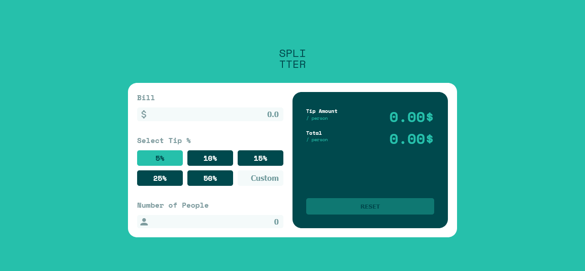
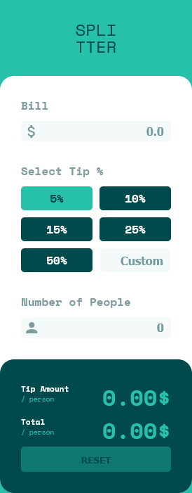

# Frontend Mentor - Tip calculator app solution

This is a solution to the [Tip calculator app challenge on Frontend Mentor](https://www.frontendmentor.io/challenges/tip-calculator-app-ugJNGbJUX). Frontend Mentor challenges help you improve your coding skills by building realistic projects.

## Table of contents

- [Overview](#overview)
  - [The challenge](#the-challenge)
  - [Screenshot](#screenshot)
  - [Links](#links)
- [My process](#my-process)
  - [Built with](#built-with)
  - [What I learned](#what-i-learned)
  - [Useful resources](#useful-resources)
- [Author](#author)

## Overview

### The challenge

Users should be able to:

- View the optimal layout for the app depending on their device's screen size
- See hover states for all interactive elements on the page
- Calculate the correct tip and total cost of the bill per person

### Screenshot

#### Desktop version:

#### Mobile version:

### Links

- Solution URL: [Solution](https://www.frontendmentor.io/solutions/react-app-using-css-flexbox-and-grid-DHcJl35IY)
- Live Site URL: [Live site](https://marcoperetto-react-tip-calculator-challenge.netlify.app/)

## My process

### Built with

- Semantic HTML5 markup
- CSS custom properties
- Flexbox
- Grid
- React
- Mobile-first workflow

### What I learned

 - React Basis

### Useful resources

- [CSS Flex Guide](https://css-tricks.com/snippets/css/a-guide-to-flexbox/)
- [CSS Grid Guide](https://css-tricks.com/snippets/css/complete-guide-grid/)

## Author

- Frontend Mentor - [@mperetto](https://www.frontendmentor.io/profile/mperetto)
- Linkedin - [Marco Peretto](https://www.linkedin.com/in/marco-peretto/)
